# 保理系统业务架构分析文档

> 基于需求文档文本 + 68 张截图多模态解析的综合整理  
> 生成时间：2026-03-13

---

## 一、系统架构总览

### 1.1 平台角色体系

系统采用 **多租户三角色** 架构：

```
┌─────────────────────────────────────────────────┐
│                  平台层（银行管理）                │
│  标签管理 · 产品定价 · 产品管理 · 协议管理 · 角色权限  │
└───────────────────┬─────────────────────────────┘
                    │
        ┌───────────┴───────────┐
        ▼                       ▼
┌──────────────┐       ┌──────────────┐
│   宿主 (Host) │       │  资金方 (FC)  │
│              │       │              │
│  运营 + 客户经理│       │  运营 + 客户经理│
│  + 复核       │       │  + 市场总监    │
│              │       │  + 风险复核    │
│              │       │  + 风险总监    │
│              │       │  + 审查委员会   │
│              │       │  + 总经理      │
└──────┬───────┘       └──────┬───────┘
       │                      │
       └──────────┬───────────┘
                  │
       ┌──────────┴──────────┐
       ▼                     ▼
┌──────────────┐    ┌──────────────┐
│  供应商/卖方   │    │  核心企业/买方  │
│  (Supplier)  │    │ (Core Ent.)  │
│              │    │              │
│  高级经办      │    │  高级经办      │
│  高级复核      │    │  高级复核      │
└──────────────┘    └──────────────┘
```

### 1.2 核心模块关系图

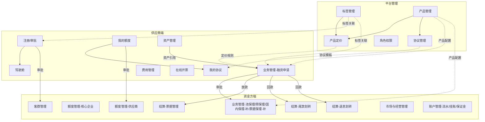

### 1.3 产品矩阵

| 产品大类 | 类型 | 追索权 | 对应现有产品名 |
|---------|------|-------|------------|
| 国内保理 | 应收账款(上游) | 有追/无追 | 国内保理-有追/无追 |
| 国内保理 | 应付账款(下游) | 有追/无追 | 下游保理国内保理-有追/无追 |
| 国内保理 | 保兑单 | 无追 | 国内保理-中兵保兑单-无追 |
| 国内保理 | 商票 | 有追/无追 | 票据保理-有追/无追(商票) |
| 国内保理 | 银票 | 有追/无追 | 票据保理-有追/无追 |
| 国内保理 | 池保理 | 有追/无追 | 池保理-有追/无追 |
| 国内保理 | 外部军工产业银票 | — | 外部军工产业票据保理-银票 |
| 国内保理 | 外部军工产品商票 | — | 外部军工产业票据保理-商票 |
| 反向保理 | 应收账款(账单) | — | 保兑单 |
| 反向保理 | 应付账款(线上应付) | — | 线上应付 |
| 汽配订单 | 汽配融 | — | 汽配融 |
| 再保理 | 再保理 | 有追/无追 | 再保理-有追/无追 |
| 预付保理 | 上游 | 有追/无追 | 预保理-有追/无追 |
| 预付保理 | 下游 | 有追/无追 | 下游保理预保理-有追/无追 |

> **共计 22 个产品 SKU**，由 `产品大类 × 类型 × 追索权` 三元组唯一确定

---

## 二、核心业务流程

### 2.1 供应商注册及审批流程

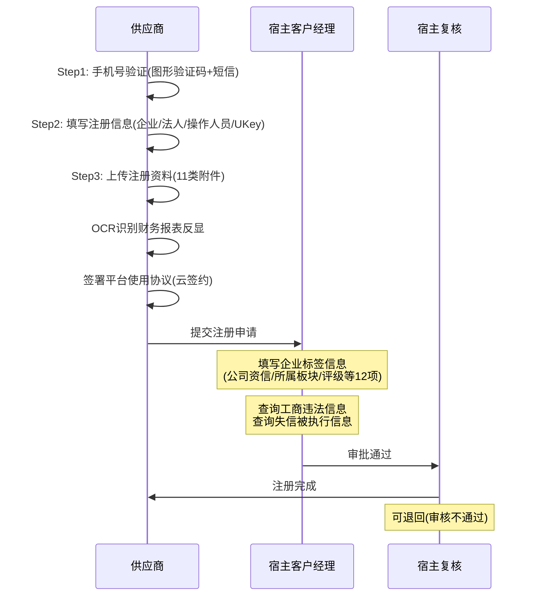

### 2.2 额度申请及审批流程（最多8级审批）

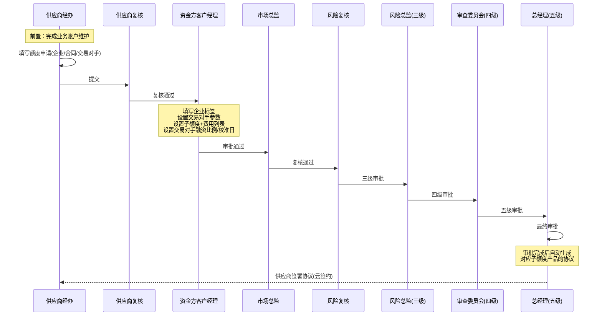

**额度审批核心信息**：
- **子额度信息**：额度编号、产品、金额、是否循环、追索权、期限、底层资产核实情况、资金用途、增信措施
- **费用列表**：收费项目、计费方式、收费方式、费率
- **交易对手**：名称、应收账款月均余额、账期、校准日、融资比例、担保方、担保比例

### 2.3 融资申请（国内保理-应收账款）全流程

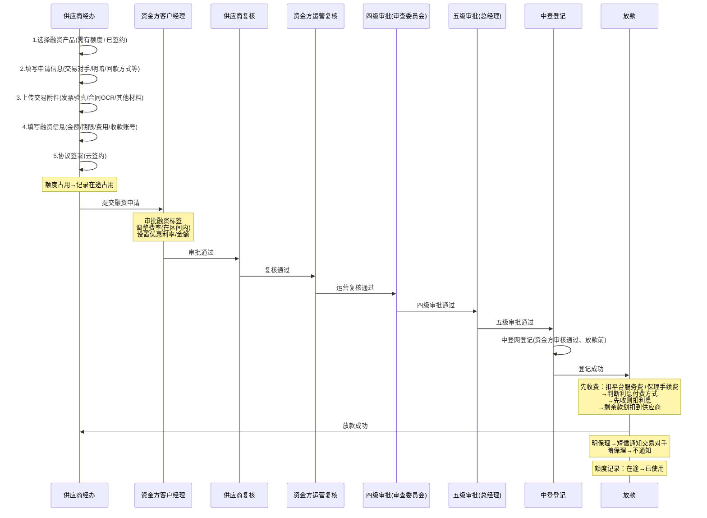

**放款失败处理**：退回供应商经办

### 2.4 保理回款流程

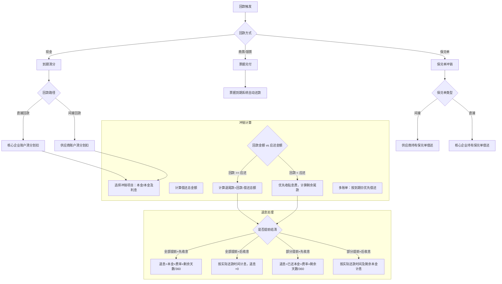

### 2.5 放款方式分支

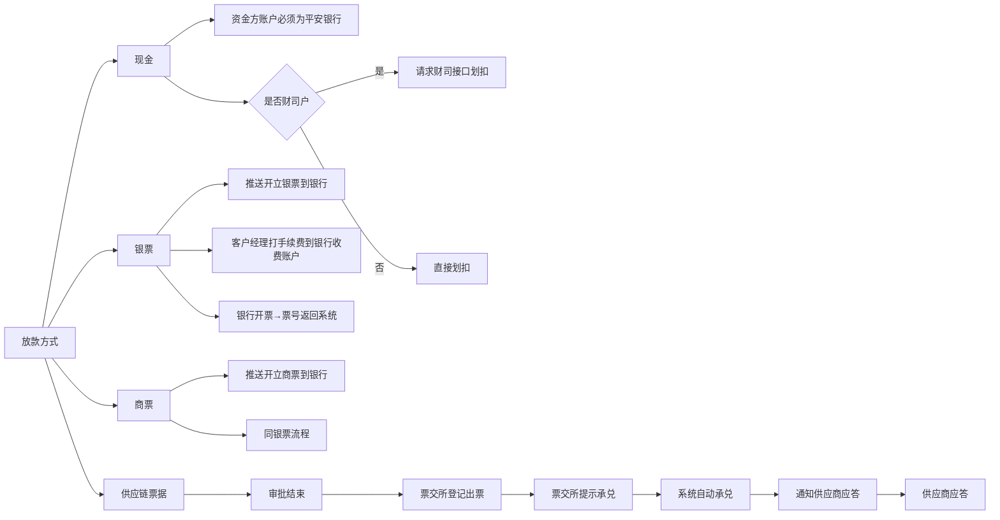

---

## 三、数据模型（核心实体关系）

```mermaid
erDiagram
    HOST ||--|{ TAG : manages
    HOST ||--|{ PRODUCT : manages
    HOST ||--|{ PRICING : configures

    TAG {
        int id
        string name
        string dimension "客户维度/融资维度"
        string enum_values
        string status "启用/停用"
        string judge_logic "判断逻辑描述"
    }

    PRODUCT {
        int id
        int host_id FK
        string category "国内保理/反向保理/预付保理..."
        string type "应收账款/商票/银票/池保理..."
        string recourse "有追/无追"
        boolean is_guarantee "是否需要担保"
        string guarantee_type "企业/个人"
        boolean is_zhongdeng "是否中登登记"
        string zhongdeng_stage "中登登记环节"
        boolean has_handling_fee "是否收取保理手续费"
        boolean show_fee_detail "供应商是否展示费用明细"
    }

    PRODUCT ||--|{ FEE_CONFIG : has
    FEE_CONFIG {
        int id
        int product_id FK
        string fee_item "保理手续费/平台服务费/利息/宽限期利息/罚息/票据服务费"
        string billing_mode "逐笔/年化/一口价"
        float fixed_rate "一口价费率%"
        string payment_mode "先收/后收/等额本金/等额本息/按月/按季/到期支付"
        boolean is_invoiceable "是否可开票"
    }

    PRICING {
        int id
        int host_id FK
        int funder_id FK
        datetime last_modified
    }

    PRICING ||--|{ TAG_PRICING : has
    TAG_PRICING {
        int pricing_id FK
        int tag_id FK
        string enum_value
        string method "调整基价/上浮/下浮"
        float value "百分比或BP"
    }

    PRICING ||--|{ PRODUCT_PRICING : has
    PRODUCT_PRICING {
        int pricing_id FK
        int product_id FK
        float base_price "基准价%"
        string linked_tags "关联标签ID列表"
        string price_range "价格区间"
        string applicable_fees "适用费项"
        string relationship "共用/并列"
    }

    SUPPLIER ||--o{ REGISTRATION : submits
    REGISTRATION {
        int id
        int supplier_id FK
        string company_name
        string unified_credit_code
        string industry
        string enterprise_nature
        string province_city
        string legal_rep_name
        string legal_rep_id
        string financial_report_json
        string status "待审批/已通过/已拒绝"
    }

    SUPPLIER ||--|{ CREDIT_APPLICATION : applies
    CREDIT_APPLICATION {
        int id
        int supplier_id FK
        int funder_id FK
        string app_number "YYYYMMDDHHMMSS001"
        decimal total_amount
        string status
    }

    CREDIT_APPLICATION ||--|{ SUB_CREDIT : contains
    SUB_CREDIT {
        int id
        int credit_app_id FK
        string credit_number
        int product_id FK
        decimal amount
        boolean is_revolving
        string recourse "有追/无追"
        date start_date
        date end_date
        int grace_period_days
        string repayment_method
        string asset_verification
        string fund_purpose
    }

    CREDIT_APPLICATION ||--|{ COUNTERPARTY : has
    COUNTERPARTY {
        int id
        int credit_app_id FK
        string company_name
        string unified_credit_code
        string legal_rep
        boolean is_approved
        boolean is_group_member
        boolean has_cooperation_agreement
        string settlement_method "现金/银票/商票/保兑单/保证金/流水挂账"
        int account_period_months
        decimal avg_receivable
        int calibration_days "校准日"
        float financing_ratio "融资比例%"
        string guarantee_party "担保方"
        float guarantee_ratio "担保比例%"
    }

    SUPPLIER ||--|{ FINANCING_APPLICATION : submits
    FINANCING_APPLICATION {
        int id
        int supplier_id FK
        int product_id FK
        int counterparty_id FK
        string app_number
        decimal invoice_total
        decimal max_loan_amount "最高可放款=发票总额×融资比例"
        decimal applied_amount
        date apply_date
        date due_date
        string loan_method "现金/银票/商票"
        string fee_payer "融资企业/交易对手/第三方"
        decimal estimated_arrival "预计到账=最高放款-费用总计"
        string receiving_account
        string receiving_bank
        boolean is_confidential "是否涉密"
        boolean is_pledged "是否质押"
        string status
    }

    FINANCING_APPLICATION ||--|{ ASSET : references
    ASSET {
        int id
        string type "发票/合同/商票/银票"
        string voucher_number
        decimal face_amount
        decimal remaining_amount
        string buyer_name
        string seller_name
        date issue_date
        date due_date
        string status
    }

    FINANCING_APPLICATION ||--|{ LOAN : generates
    LOAN {
        int id
        int financing_app_id FK
        string loan_number
        decimal loan_amount
        decimal remaining_principal
        date loan_date
        date due_date
        string loan_method
        string status "在途/已放款/已结清"
    }

    LOAN ||--|{ FEE_RECORD : has
    FEE_RECORD {
        int id
        int loan_id FK
        string fee_item
        string billing_mode
        string payment_mode
        float rate
        decimal calculated_amount
        decimal actual_amount
        decimal discount_rate "优惠利率"
        decimal discount_amount "优惠金额"
        string payer "付费方"
        boolean is_collected
    }

    LOAN ||--|{ REPAYMENT : has
    REPAYMENT {
        int id
        int loan_id FK
        string repayment_method "现金/商票/银票/保兑单"
        decimal repayment_amount
        decimal principal_repaid
        decimal interest_repaid
        decimal tail_amount "尾款金额"
        decimal refund_interest "退息金额"
        date repayment_date
        string status
    }

    FUNDER ||--|{ BUSINESS_ACCOUNT : has
    BUSINESS_ACCOUNT {
        int id
        int funder_id FK
        string account_name
        string account_number
        string bank_name
        decimal balance
    }

    BUSINESS_ACCOUNT ||--|{ TRANSACTION_FLOW : records
    TRANSACTION_FLOW {
        int id
        int account_id FK
        string flow_number
        date transaction_date
        decimal amount
        string currency
        string payer_account
        string payer_name
        string direction "转入/转出"
        string payee_account
        string payee_name
        string remark
    }
```

---

## 四、状态机定义

### 4.1 供应商注册状态机

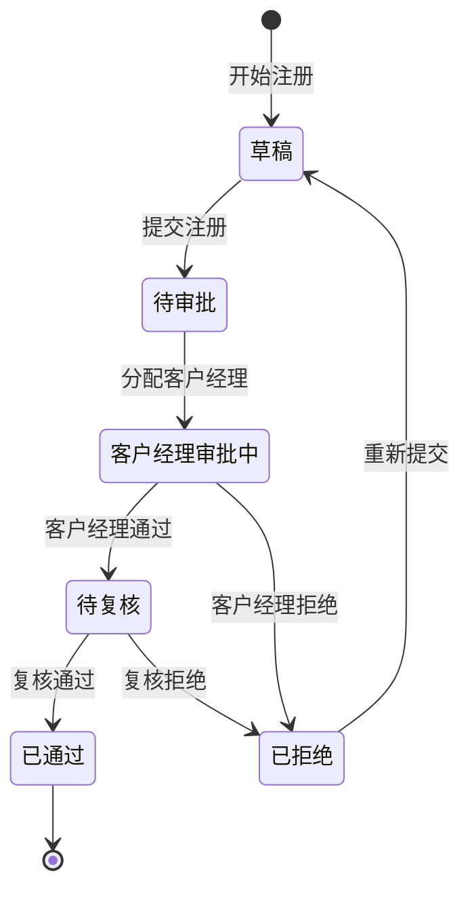

### 4.2 额度申请状态机

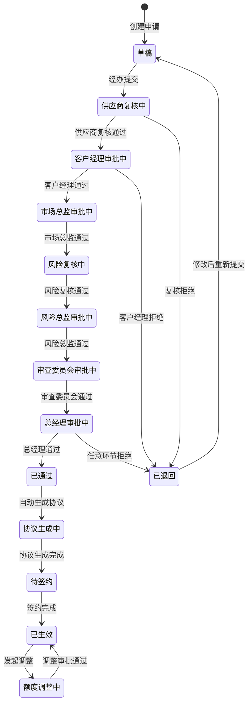

### 4.3 融资申请状态机

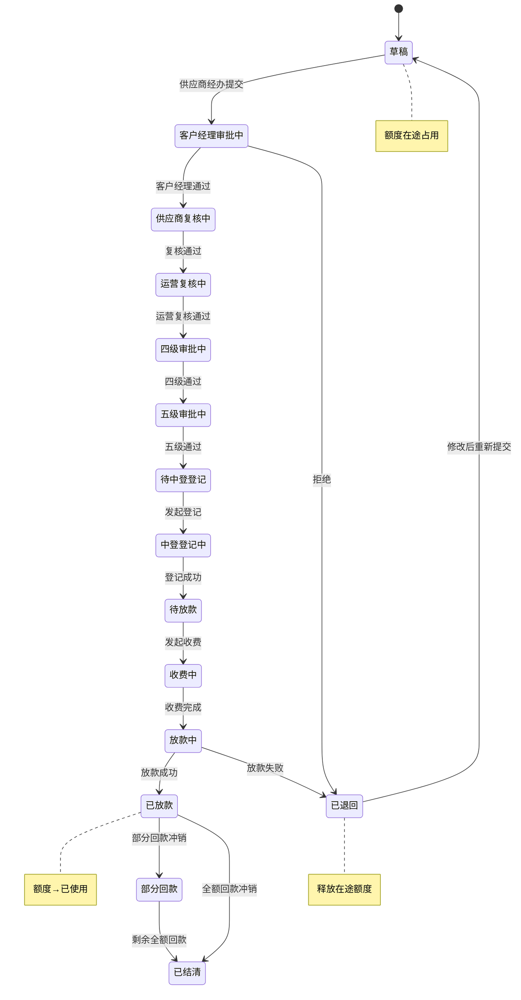

### 4.4 额度占用状态机

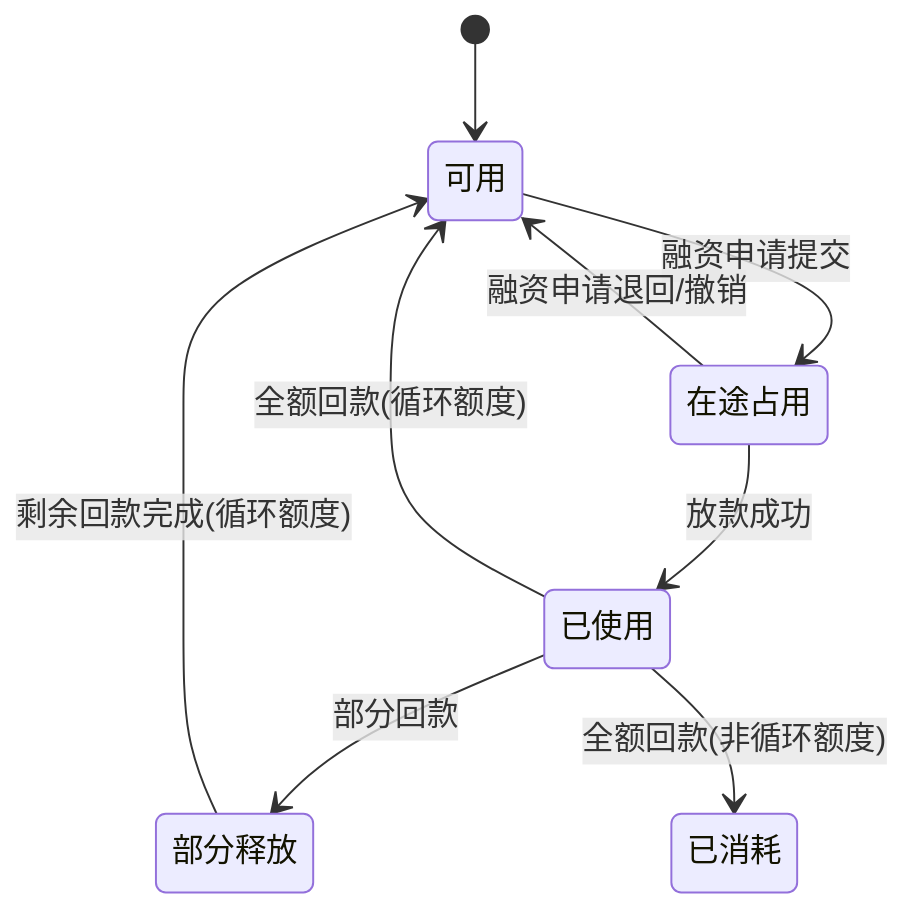

---

## 五、角色权限矩阵

### 5.1 宿主角色

| 功能模块 | 客户经理 | 运营(原经办) | 复核 |
|---------|---------|------------|------|
| 注册审批-填标签 | ✅ 主办 | ❌ | ✅ 复核 |
| 修改企业信息 | ✅ | ✅ | ✅ |
| 客户管理 | ✅ | ✅ | ✅ |
| 额度管理 | ✅ 配合资金方 | ✅ | ❌ |

> 客户经理有"组别"概念，同组成员可互相处理任务

### 5.2 资金方角色

| 功能模块 | 客户经理 | 运营(原经办) | 运营复核 | 市场总监 | 风险复核 | 风险总监 | 审查委员会 | 总经理 |
|---------|---------|------------|---------|---------|---------|---------|---------|-------|
| 客户管理-增删改查 | ✅ | ✅ | ✅ | — | — | — | — | — |
| 核心企业额度-新增 | ✅ 主办 | — | — | ✅ 复核 | ✅ | ✅ 三级 | ✅ 四级 | ✅ 五级 |
| 供应商额度-新增 | ✅ 主办 | — | — | ✅ 复核 | ✅ | ✅ | ✅ | ✅ |
| 融资审批-标签/费率 | ✅ 主办 | — | ✅ 复核 | — | — | — | ✅ 四级 | ✅ 五级 |
| 池保理/预保理新增 | ✅ 提交 | ✅ 审批 | ✅ 复核 | — | — | — | — | — |
| 结算-尾款/退息 | — | ✅ 经办 | ✅ 复核 | — | — | — | — | — |
| 营销管理 | ✅ 录入 | ✅ 审批 | ✅ 复核 | — | — | — | — | — |
| 账户管理 | — | ✅ | ✅ | — | — | — | — | — |

### 5.3 供应商角色

| 功能模块 | 高级经办 | 高级复核 |
|---------|---------|---------|
| 注册 | ✅ 主办 | ❌ |
| 额度申请 | ✅ 主办 | ✅ 复核 |
| 融资申请 | ✅ 主办 | ✅ 复核 |
| 资产管理 | ✅ | ✅ |
| 费用管理-查看 | ✅ | ✅ |
| 我的协议-签约 | ✅ | — |
| 我的额度 | ✅ | ✅ |

---

## 六、计费引擎规则全集

### 6.1 费用项目枚举

| 费用项目 | 适用产品 | 计费方式 | 收费方式 |
|---------|---------|---------|---------|
| 保理手续费 | 所有 | 逐笔 | 先收 |
| 平台服务费 | 所有 | 逐笔/年化 | 先收/按月/按季 |
| 利息 | 所有 | 年化/一口价 | 先收/等额本金/等额本息/按月/按季/到期还本付息 |
| 宽限期利息 | 所有 | 年化 | — |
| 罚息 | 所有 | 年化 | — |
| 票据服务费 | 票据类产品 | 逐笔 | 先收 |
| 贴息费 | 票据回款 | 逐笔 | 当场收取 |

### 6.2 利息计算公式详解

| 付费模式 | 计算公式 | 期数规则 |
|---------|---------|---------|
| **先收** | `融资金额 × 费率 × 期限 / 360` | — |
| **等额本金** | 每月本金 = `融资金额 / 还款月数`<br/>日利率 = `利率 / 360`<br/>利息 = `剩余本金 × 日利率 × 天数` | 算头不算尾，还款日当日不算，首期按贷款日计算 |
| **等额本息** | `[本金 × 月利率 × (1+月利率)^月数] / [(1+月利率)^月数 - 1]` | 同上 |
| **按月(每月20日)** | 每期 = `本金 × 费率 / 360 × 当期天数`<br/>到期日<月度结算日时，到期还本+剩余利息 | — |
| **按季(3/6/9/12月20日)** | 每期 = `本金 × 费率 / 360 × 当期天数`<br/>到期日<季度结算日时，到期还本+剩余利息 | — |
| **到期还本付息** | `本金 × 费率 / 360 × 期数` | — |

### 6.3 定价引擎逻辑

```
最终费率 = f(产品基准价, 标签定价调整, 客户经理微调, 优惠)

1. 取产品基准价 base_rate
2. 遍历该笔融资关联的所有标签：
   - 如果标签定价方式="调整基价" → 替换 base_rate = 标签值
   - 如果标签定价方式="上浮" → base_rate += 标签值(BP)
   - 如果标签定价方式="下浮" → base_rate -= 标签值(BP)
3. 计算价格区间 [min, max]：
   - 如果有多条"调整基价"标签：min = 最低基价 - 累计下浮, max = 最高基价 + 累计上浮
4. 费项关系处理：
   - "共用"：所有费项费率加总必须在价格区间内
   - "并列"：每个单独的费用项目费率必须在价格区间内
5. 客户经理在 [min, max] 内修改最终费率
6. 可在营销优惠区间内设置优惠利率/优惠金额
```

### 6.4 退息计算规则

| 场景 | 息方式 | 退息公式 |
|------|-------|---------|
| 全部提前结清 | 先收 | `本金 × 费率 × 剩余天数 / 360` |
| 全部提前结清 | 后收 | 按实际还款时间计息，退息=0 |
| 部分提前结清 | 先收 | `已偿还本金 × 费率 × 剩余天数 / 360` |
| 部分提前结清 | 后收 | 按实际还款时间+剩余本金计息 |

---

## 七、硬编码场景分析

### 7.1 需要解耦的硬编码逻辑

| 序号 | 硬编码点 | 当前实现 | 建议方案 |
|------|---------|---------|---------|
| 1 | 标签对价格的影响 | "对价格的影响需要代码开发实现" | 设计DSL规则引擎，标签→价格 映射可配置 |
| 2 | 融资标签自动判断 | 部分根据业务数据自动判断（金额区间/期限区间/是否集团等） | 将判断规则提取为可配置的Expression |
| 3 | 22种产品的差异化流程 | 不同产品走不同代码分支 | 产品化配置：产品×流程节点 矩阵化 |
| 4 | 放款方式分支（现金/银票/商票/供应链票据） | 4种放款走4套不同逻辑 | 策略模式+接口适配器 |
| 5 | 回款方式分支（现金/商票/银票/保兑单） | 4种回款走4套逻辑，其中保兑单又分直接/间接 | 同上 |
| 6 | 费率计算方式 | 7种利息模式各自实现 | 计费引擎工厂模式，每种模式一个策略类 |
| 7 | 中登登记环节配置 | 硬编码"资金方审核通过放款前" | 可配置流程节点 |
| 8 | OCR识别分支 | 合同OCR/发票OCR/票据OCR/财务报表OCR | 统一OCR服务+策略分发 |
| 9 | 审批层级配置 | 最多8级审批写死 | 工作流引擎可配置审批链 |
| 10 | 回款冲销优先级 | "优先到期日临近的账单偿还" | 可配置偿还排序策略 |
| 11 | 额度占用逻辑 | 供应商额度+买方额度双向占用 | 额度服务抽象化 |
| 12 | 协议模板按产品生成 | "有几个产品生成几份合同" | 协议模板引擎 |

### 7.2 外部系统集成点

| 序号 | 外部系统 | 用途 | 接口方向 |
|------|---------|------|---------|
| 1 | 平安银行 | 资金划扣（放款/收费/尾款划转） | 双向 |
| 2 | 财司系统 | 财司户资金划扣 | 调用 |
| 3 | 中登网 | 应收账款登记/查询/撤销 | 双向 |
| 4 | 橙E-银行票据系统 | 银票开立/查额度/查手续费率 | 调用 |
| 5 | 橙E-KYCR | 商票查费用/开票手续费率 | 调用 |
| 6 | 票交所 | 供应链票据登记出票/提示承兑/应答 | 双向 |
| 7 | OCR服务 | 合同/发票/票据/财务报表识别 | 调用 |
| 8 | 云签约平台 | 协议签署/征信授权书签署 | 调用 |
| 9 | CFCA数字证书 | 数字证书授权 | 调用 |
| 10 | 短信平台 | 注册验证码/交易对手通知 | 调用 |
| 11 | 工商信息查询 | 违法信息/失信被执行信息 | 调用 |

### 7.3 开发优先级建议

```
Phase 1 (一期) — 核心闭环
├── 供应商注册+审批
├── 我的额度(额度申请+审批)
├── 我的协议(签约)
├── 产品管理+标签管理+定价基础
└── 基础角色权限

Phase 2 (二期) — 业务主体
├── 国内保理全流程(融资申请→审批→中登→放款→回款→冲销)
├── 计费引擎(7种模式)
├── 资产管理(OCR集成)
├── 票据保理
├── 池保理
├── 预保理
├── 费用管理+在线开票
└── 结算(尾款/退息/票据兑付)

Phase 3 (三期) — 运营支撑
├── 驾驶舱
├── 市场与经营管理(营销/看板/指标/年度目标)
├── 账户管理(流水/挂账/保证金)
├── 反向保理/汽配订单/再保理
├── 费用拆分
└── 统计报表
```

---

## 附录A：页面清单

| 编号 | 模块 | 页面 | 类型 | 对应截图 |
|------|------|------|------|---------|
| P01 | 银行管理 | 标签管理-客户维度编辑 | 配置表格 | img_001 |
| P02 | 银行管理 | 标签管理-融资维度编辑 | 配置表格 | img_002 |
| P03 | 银行管理 | 产品定价-标签定价Tab | 配置表格 | img_003 |
| P04 | 银行管理 | 产品定价-产品定价Tab | 配置表格 | — |
| P05 | 银行管理 | 产品管理-产品配置 | 表单 | img_004 |
| P06 | 银行管理 | 产品管理-费项配置 | 表单 | img_005 |
| P07 | 银行管理 | 协议管理 | 列表+编辑 | — |
| P08 | 供应商 | 注册Step1-手机号验证 | 向导表单 | img_007 |
| P09 | 供应商 | 注册Step2-注册信息 | 向导表单 | img_008 |
| P10 | 供应商 | 注册Step3-上传资料 | 向导表单 | img_009 |
| P11 | 供应商 | 注册-财务报表 | 表单 | img_010 |
| P12 | 供应商 | 注册审批-标签填写 | 审批表单 | img_011 |
| P13 | 供应商 | 注册审批-详情 | 查看 | img_012 |
| P14 | 供应商 | 驾驶舱 | Dashboard | img_013 |
| P15 | 供应商 | 国内保理-融资列表 | 列表 | img_014 |
| P16 | 供应商 | 融资申请-交易附件发票Tab | 附件管理 | img_015 |
| P17 | 供应商 | 融资申请-费用列表 | 表格 | img_016 |
| P18 | 供应商 | 融资申请-收款账号 | 表单 | img_017 |
| P19 | 供应商 | 保理融资凭证 | 凭证模板 | img_018 |
| P20 | 供应商 | 回款冲销 | 操作表单 | img_020 |
| P21 | 供应商 | 应收账款管理列表 | 列表 | img_021 |
| P22 | 供应商 | 费用管理 | 列表 | img_022 |
| P23 | 供应商 | 在线开票 | 功能页 | img_023 |
| P24 | 供应商 | 邮寄地址 | 列表 | img_024 |
| P25 | 供应商 | 我的额度列表 | 列表 | img_025 |
| P26 | 供应商 | 额度申请 | 表单 | img_026/027 |
| P27 | 供应商 | 客户经理审批-标签 | 审批表单 | img_028 |
| P28 | 供应商 | 客户经理审批-额度/费用 | 审批表单 | img_029/030 |
| P29 | 供应商 | 我的协议 | 列表 | img_031 |
| P30 | 资金方 | 客户管理列表 | 列表 | img_032 |
| P31 | 资金方 | 核心企业额度列表 | 列表 | img_033 |
| P32 | 资金方 | 核心企业额度编辑 | 表单 | img_034 |
| P33 | 资金方 | 供应商额度列表 | 列表 | img_035 |
| P34 | 资金方 | 池保理列表 | 列表 | img_036 |
| P35 | 资金方 | 池保理-新增/申请 | 表单 | img_037 |
| P36 | 资金方 | 预保理列表 | 列表 | img_038 |
| P37 | 资金方 | 预保理-新增/申请 | 表单 | img_039/040/041 |
| P38 | 资金方 | 国内保理-补列表 | 列表 | img_042 |
| P39 | 资金方 | 票据保理-补列表 | 列表 | img_043 |
| P40 | 资金方 | 票据管理-回款兑付 | 列表 | img_044/045 |
| P41 | 资金方 | 票据管理-放款承兑 | 列表 | img_046 |
| P42 | 资金方 | 尾款划转 | 列表+操作 | img_047/048 |
| P43 | 资金方 | 退息划转 | 列表+操作 | img_049/050 |
| P44 | 资金方 | 业务指标管理 | 列表+编辑 | img_051/052 |
| P45 | 资金方 | 客户营销管理-录入 | 列表+编辑 | img_053/054 |
| P46 | 资金方 | 客户营销管理-统计 | 列表 | img_055 |
| P47 | 资金方 | 核心企业业务看板 | 列表+编辑(6屏) | img_056~062 |
| P48 | 资金方 | 年度目标 | 列表 | img_063 |
| P49 | 资金方 | 账户管理 | 列表 | img_064 |
| P50 | 资金方 | 交易流水 | 流水查询 | img_065 |
| P51 | 资金方 | 流水挂账 | 操作 | img_066 |
| P52 | 资金方 | 保证金挂账列表 | 列表 | img_067 |
| P53 | 资金方 | 保证金挂账操作 | 操作 | img_068 |

> **共计 53 个独立页面**（不含子Tab和弹窗）
